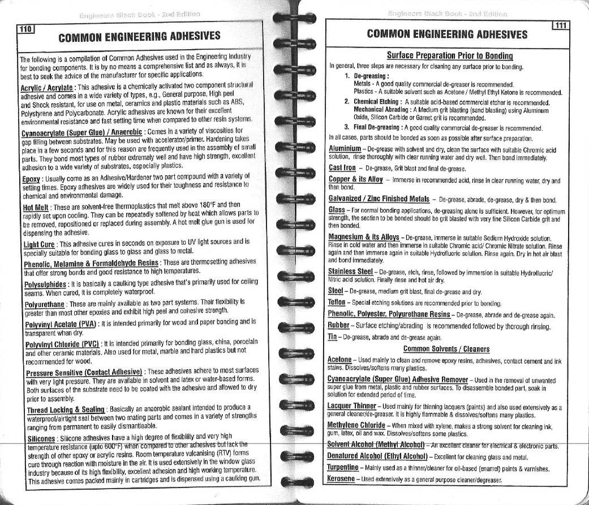

# Adhesives

## General Adhesives

## Thread Locking Fluid

These adhesives are typically referred to Loctite after the well-known brand. They are methacrylate-based and cure anaerobically \(in the absence of air\). They are available in a range of strengths.

For most general engineering uses they are available in 10ml or 25ml bottles.

Typical grades that may be used are:

### Low Strength

Loctite 222. Used for low strength applications or small fixings, M4 or smaller.

### Medium Strength

Loctite 243. Used for general thread locking applications where the fixing may need to be removed or replaced at some during its life.

### High Strength

Loctite 270. Used where it is not expected that fixing will need to be removed or replaced. It is likely that is used on a small fixing, the fixing head will become damaged before removal is possible.

