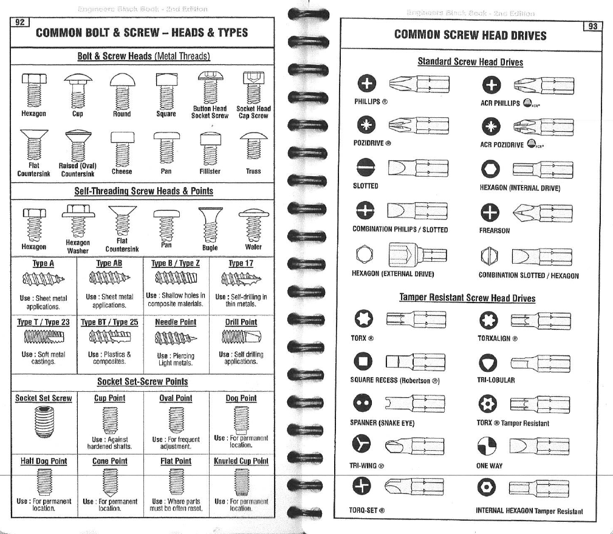
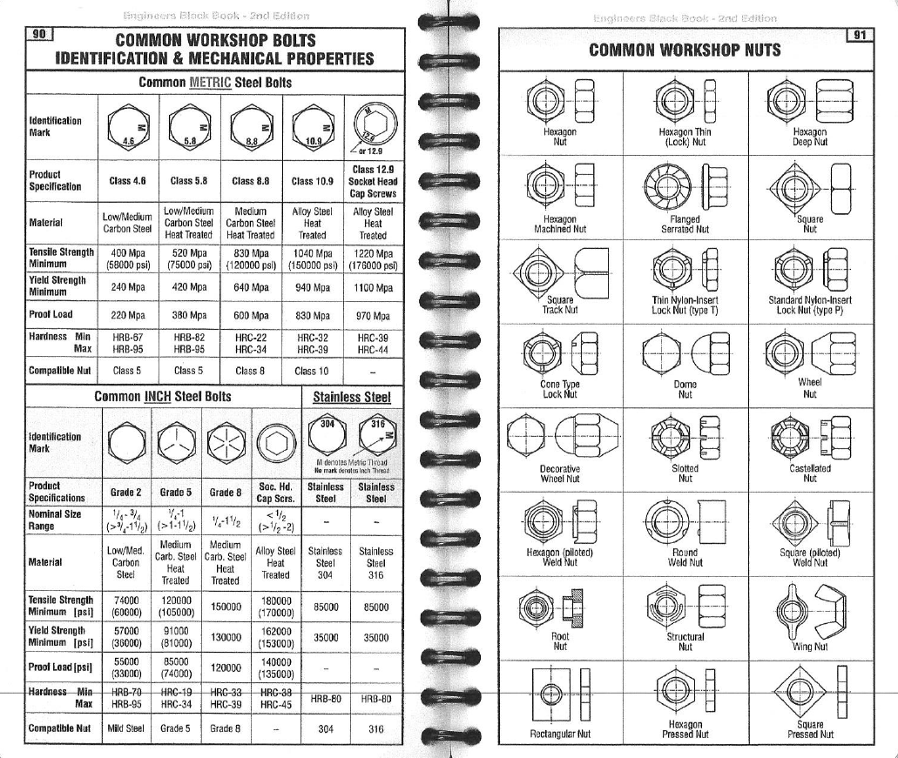

# Bolts

## Bolts

### Bolt Grades

Metric steel bolts are supplied in four key types of varying strength. It is possible to determine the type of the bolt by identifying the markings on the head of the bolt.

| Class | Size \(mm\) | Min Yield Strength | Min Tensile Strength |  |
| :--- | :--- | :--- | :--- | :--- |
| 8.8 | Medium Carbon Steel | &lt;16 | 540 | 800 |
| 10.9 | Alloy steel | 50-100 | 940 | 1040 |
| 12.9 | Alloy steel, quenched and tempered | 1.5-100 | 1100 | 1220 |
| A2 | Stainless Steel with 17-19% chromium and 8-13% nickel | Upto 20 | 450 | 500 |

### Bolt Head Types

### Nut Types

### Torque Settings

Bolt torque setting are dependent on a number of factors:

* fixing size
* material
* finish \(plating\)

{% embed url="https://www.grampianfasteners.com/blog/torque\_settings\_%E2%80%93\_suggested\_starting\_values" %}

Washers



